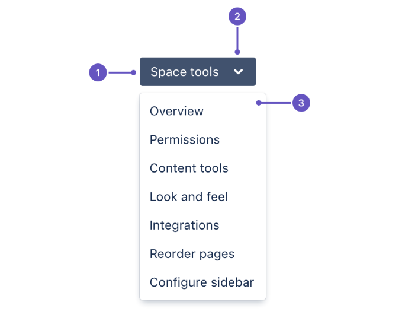

Dropdown menus are typically used when you have 5-15 items to choose from.
They're used for navigation or command menus,
where an action is initiated based on the selection.

Menu items can include both [radio buttons](/components/radio) and [checkboxes](/components/checkbox).

Some other uses for dropdown menus:

- A "more" menu, where the control contains an icon.
- For user profiles, where the control is an [avatar](/components/avatar).

## Anatomy

1. **Control:** A button that may contain an icon, or be labeled with text.
1. **Trigger:** Used if the button is labeled with text.
1. **Menu:** Container for links and action items.

## Best practices

- A number of components can be used to give people the ability to select options.
  See the listed of related components below for advice on choosing the right one.
- When organizing dropdown menu items,
  sort the list in a logical order by putting the most selected option at the top,
  if known.
  Test and refine over time to re-evaluate if all menu items are needed.
- For long lists,
  group related menu items.
  If including radio buttons and checkboxes as menu items,
  try grouping related actions.

## Content guidelines

- People navigate menus and choose menu items based on their labels,
  so it’s important that they're accurate and informative.
- In general,
  use sentence case and write concise labels that clearly indicate the purpose of the selection.
- For action menu items,
  use verbs and verb phrases to describe the action that occurs when the item is chosen.
  For example,
  “Move”,
  “Log time”,
  or “Hide epic labels”.
- In most cases,
  links should be nouns.
  For example,
  Profile or Keyboard shortcuts.
- Exclude articles in menu items.
  For example, use Add flag instead of Add a flag.
- Keep menu items to a single line of text.

## Related

- To allow users to search and select one or more options from a list,
  use the [select](/components/select) component.
- To collect user input from a related list of items use [checkboxes](/components/checkbox).
- To allow users to make a single selection from a short list,
  use [radio buttons](/components/radio).
